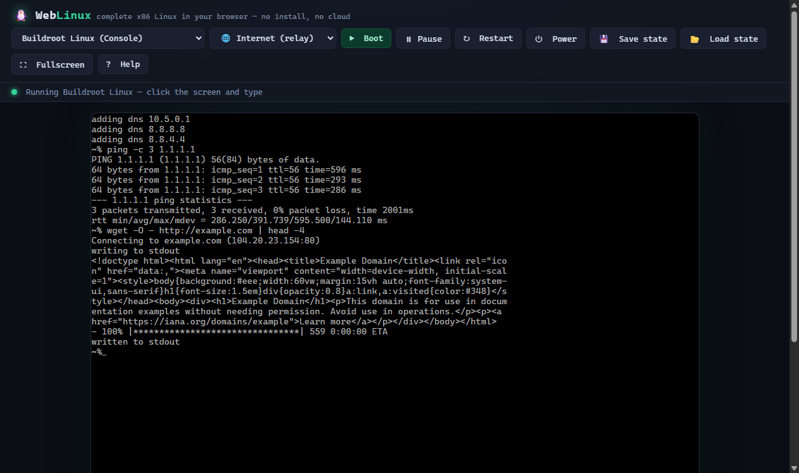

# WebLinux — Complete Linux in your Browser

```
 _       __     __    __    _
| |     / /__  / /_  / /   (_)___  __  ___  __
| | /| / / _ \/ __ \/ /   / / __ \/ / / / |/_/
| |/ |/ /  __/ /_/ / /___/ / / / / /_/ />  <
|__/|__/\___/_.___/_____/_/_/ /_/\__,_/_/|_|
```

> **Any visitor can now:** open the link → watch Linux (or Windows 2000, FreeBSD,
> Haiku, KolibriOS) boot in their browser → connect to the internet inside the
> guest → save/load the whole machine state. **No server. No install. No account.**

▶️ **Try it live:** <https://alizafar780.github.io/WebLinux/>



---

## What is this?

A self-contained web app that boots **real, unmodified Linux kernels** inside a
browser tab. The entire x86 machine — CPU, BIOS, RAM, IDE/ATAPI disk controller,
PS/2 keyboard & mouse, VGA — is emulated client-side by the open-source
[v86](https://github.com/copy/v86) emulator running on **WebAssembly**. No
backend exists: the page loads, the guest boots, and everything happens in
your tab.

## What can visitors do?

- Boot **5 real Linux systems** and switch between them live (the machine reboots on switch)
- Work at a **genuine BusyBox shell** — or a **graphical desktop** (DSL's JWM + Firefox 2)
- Connect the guest to the **real internet**: DHCP, `ping`, `wget`, DNS — all from inside the emulator
- **Save / Load machine state** — snapshot the entire VM to a file and resume later
- Pause, resume, restart, power off, go fullscreen
- Type with a real keyboard, including special keys browsers normally steal (Ctrl+Alt+Del → Ctrl+Alt+Insert)

## Quick start (local)

```bash
python serve.py          # -> http://127.0.0.1:8001
```

or any static server (`npx serve`, `python -m http.server 8001`). Open the URL
in Chrome/Edge/Firefox — the default distro boots automatically.

> ⚠️ Do **not** open `index.html` via `file://` — the emulator needs HTTP for
> its WebAssembly worker and range reads.

## The systems (9 total)

| Distro | Media | Size | UI | Notes |
|---|---|---|---|---|
| **Buildroot Linux** | bzImage | 5 MB | BusyBox console | default; boots to `~%` in ~5–7 s |
| **Buildroot Linux 6.8** | bzImage | 10 MB | BusyBox console | newer kernel (6.8) |
| **TinyCore 11** | ISO | 19 MB | console | micro-distro, full ISO boot via SeaBIOS |
| **Damn Small Linux** | ISO | 50 MB | **JWM desktop + Firefox 2** | real graphical X11 session |
| **NodeOS** | bzImage | 14 MB | Node.js REPL as the OS shell | the OS *is* a JavaScript runtime |
| **Windows 2000** | ISO + HDD | 372 MB | **Installer → Desktop** | local-only; install persists to disk via HTTP PUT |
| **KolibriOS** | ISO | 97 MB | **GUI desktop** | assembly-written OS; desktop in ~6 s |
| **FreeBSD 14.4** | ISO | 557 MB | BSD installer | macOS's ancestor; local-only |
| **Haiku** | ISO | ~250 MB | **BeOS-style GUI** | Mac-like; local-only (32-bit build) |

Images live in `images/`; engine files are `v86.js`, `v86.wasm`,
`v86-fallback.wasm`, `bios/seabios.bin`, `bios/vgabios.bin`.

## Networking — verified working

The virtual **NE2000 PCI NIC** is bridged to the real internet through v86's
public WebSocket relay (`wss://relay.widgetry.org/` — raw Ethernet frames over
WebSocket). From inside the guest:

```sh
udhcpc                        # DHCP via the relay -> lease (e.g. 10.5.118.23)
ping -c 3 1.1.1.1             # verified: 0% packet loss
wget -O - http://example.com  # verified: real DNS + TCP + HTTP, full HTML back
```

- Toolbar selector: **Internet (relay)** / **Local proxy** (`ws://127.0.0.1:8080`
  for your own v86 wsproxy) / **Off**
- Footer shows **live packet counters** (▲ TX / ▼ RX) from the NIC bus
- Relay traffic is unencrypted Ethernet frames — fine for a demo, treat it as a public network

## Sound

v86 emulates the **PC speaker** (PIT ch.2 + port 0x61) and an **SB16-style DAC**
(AudioWorklet). Browsers require a user gesture, so the first click on the
screen unmutes (footer shows `🔊 audio: on`). Guests need their own sound
drivers — DSL and other distros with sb16/ALSA support will produce sound; the
minimal Buildroot kernel has none by default.

## Performance notes

- Kernel cmdline gets `quiet` + aggressive speed flags appended automatically:
  `audit=0 nowatchdog nmi_watchdog=0 loglevel=0` — almost no console writes →
  almost no DOM text rendering → buildroot boots to shell in ~6 s
- Buildroot profiles boot with `tsc=reliable mitigations=off
  random.trust_cpu=on` (v86's own defaults)
- RAM tuned per distro (128 MB for the bzImage systems — smaller WASM memory,
  less browser pressure)
- ISO boots use **async streaming** (v86 range requests) — the machine starts
  booting while the ISO is still downloading (needs a Range-capable server;
  `serve.py` provides one)
- `serve.py` smart caching: `no-store` only for `index.html` + writable disk
  images; everything else caches 24 h → reloads are near-instant (the 557 MB
  FreeBSD ISO never re-downloads)
- Preload hints in `<head>` kick off the engine + default image downloads
  during page parse
- Text mode renders via the DOM (25 rows × 16 px); the `<canvas>` only activates
  in graphics mode (e.g. the DSL desktop) — this keeps text rendering fast

## How it works

1. `v86.js` instantiates a virtual x86 PC and loads `v86.wasm` (the CPU core).
2. `seabios.bin` + `vgabios.bin` provide firmware (needed for ISO/HD boots;
   bzImage boots skip firmware).
3. The selected image attaches as bzImage / IDE disk / CD-ROM.
4. The guest boots normally — you get a genuine Linux shell (or desktop).
5. `window.__emu` is exposed for automation (used by `tools/capture_demo.js`).

## Keyboard map (guest)

| Combo | Effect |
|---|---|
| Ctrl+Alt+Insert | Ctrl+Alt+Del (reboot guest) |
| Ctrl+C | interrupt |
| Ctrl+Z | suspend job |
| Ctrl+L | clear terminal |
| Alt+F4 | close X11 window |

## Troubleshooting

| Symptom | Fix |
|---|---|
| Black screen, no boot | Use HTTP, not `file://`; try a different browser |
| No sound | Click the screen once (autoplay policy); use a distro with sb16/ALSA (DSL) |
| No network | Set mode to **Internet (relay)**; the relay is a free public service and can be busy |
| Slow first boot | v86.wasm (~1.4 MB) + image download from GitHub Pages CDN — cached afterwards |

## Local-only systems (not on GitHub)

Some OS images are **too large for GitHub** (100 MB/file limit) and are
git-ignored — they work **only when run locally** with `python serve.py`:

| File | Size | Why local-only |
|---|---|---|
| `images/Windows2000ProfessionalSP3.iso` | 372 MB | Over GitHub limit + copyrighted |
| `images/win2000.img` | 1 GB | Your Windows 2000 install state |
| `images/freebsd-bootonly.iso` | 557 MB | Over GitHub limit |
| `images/haiku-master-*-anyboot.iso` | 659 MB | Over GitHub limit |
| `v86_old.js` / `v86_old.wasm` / `v86_old-fallback.wasm` | ~4 MB | Old-engine rollback backups |

The demo handles this gracefully:

- **On GitHub Pages** these distros show a `[local]` tag in the dropdown. If you
  pick one, instead of a broken boot you get a clear message: *"X is
  local-only — its image is too large to host on GitHub Pages. Run it on your
  own machine: python serve.py → http://127.0.0.1:8001"*
- **Locally** they boot normally (the demo pre-checks the image exists via a
  HEAD request before starting the emulator)
- The shipped-on-GitHub images (Buildroot ×2, TinyCore, DSL, NodeOS,
  KolibriOS) are all under the limit and boot anywhere

## Project layout

```
WebLinux/
├── index.html              # the demo app (UI + emulator wiring)
├── v86.js                  # v86 emulator core (latest release build, Jul 2026)
├── v86.wasm                # WebAssembly CPU engine (SIMD)
├── v86-fallback.wasm       # non-SIMD fallback engine
├── v86_all.js              # full official build (reference)
├── bios/
│   ├── seabios.bin
│   └── vgabios.bin
├── images/                 # Linux boot images (see table)
├── tools/
│   ├── capture_demo.js     # headless-Chrome CDP driver -> records demo frames
│   └── stitch_gif.py       # Pillow GIF stitcher (dedupes identical frames)
└── serve.py                # local HTTP server (correct MIME types)
```

### Re-recording the demo assets

```bash
python serve.py                                   # terminal 1
node tools/capture_demo.js                        # terminal 2 -> _frames/*.jpg + hero.png
python tools/stitch_gif.py --width 640 --fps 6    # -> animated GIF (optional)
```

## Verified working (headless Chrome, Aug 1 2026)

- ✅ Buildroot kernel boots to a BusyBox shell prompt (`~%`) — confirmed via
  serial console (`?serial=1` captures `serial0-output-byte`)
- ✅ VGA text mode renders the boot log into the DOM, e.g.
  `ne2k-pci 0000:00:05.0 eth0: RealTek RTL-8029 found`
- ✅ Full internet in the guest: DHCP lease, `ping` 0% loss, `wget` real page
- ✅ Lifecycle events (`emulator-ready` / `emulator-started` / `emulator-loaded`)
  fire on the `bus` — loading overlay hides reliably
- ✅ Boots on GitHub Pages from a cold tab in ~17 s (verified headless)

Debug notes: the demo runs the **latest v86 release build** (Jul 2026) with a
plain-name public API (`emulator.bus`, `save_state()`, `restore_state()`,
`speaker_adapter.audio_context`). Machine events (`emulator-ready`,
`emulator-started`, `download-progress`, `net0-send`/`net0-receive`) fire on
`emulator.bus`. `console=tty0 console=ttyS0` enables the serial console for
debugging (`?serial=1`). The engine is prebuilt with `fastboot: true` (skips
the SeaBIOS POST memory test) and `use_graphical_text: true` (text mode renders
to canvas instead of DOM).

## Roadmap ideas

- More distros (Alpine, KolibriOS, FreeDOS, ReactOS)
- Custom kernel builds with virtio-net / virtio-gpu for speed
- Public wsproxy so local-mode networking works for remote visitors
- Persistence via OPFS / IndexedDB (auto-save state)

## Credits & license

- Emulator: [v86](https://github.com/copy/v86) by Fabian Hemmer / copy.sh — BSD-2-Clause
- Images: hosted upstream by [copy.sh](https://copy.sh/v86/) / i.copy.sh
- Demo UI, tooling, docs: original — see `LICENSE` (BSD-2-Clause, v86 attribution)
